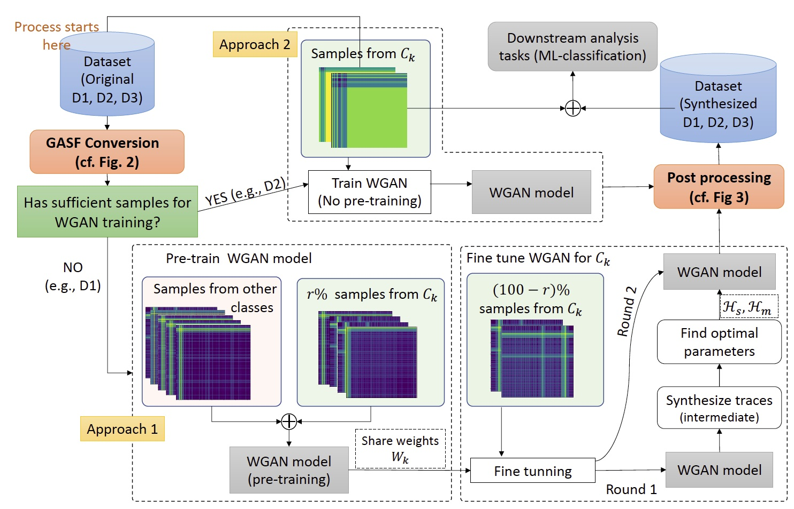

# SyNIG
This is the repository of the accepted paper [SyNIG: Synthetic Network Traffic Generation through Time Series Imaging](https://www.computer.org/csdl/proceedings-article/lcn/2023/10223392/1QdFP7dtBBK) in IEEE Local Computer Networks (IEEE LCN) 2023.

## Requirements
Following packages are required.

* Numpy				
*	Pandas			
*	matplotlib
* scipy           1.4.1
* pyts            0.12.0

## Breif overview of OpCASH

Immense growth of network usage and the associated
proliferation of network, traffic, traffic classes, and diverse
QoS requirements pose numerous challenges for network operators.
Though data-driven approaches can provide better solutions
for these challenges, limited data has been a barrier to developing
those methods with high resiliency. In this work, we propose
SyNIG (Synthetic Network Traffic Generation through Time
Series Imaging) , which utilizes Generative Adversarial Networks
(GANs) for network traffic synthesis by converting time series
data to a specific image format called GASF (Gramian Angular
Summation Field). With GASF images we encode correlation
between samples in 1D signals on a single 2D pixel map. Taking
three types of network traffic; video streaming, accessing websites
and IoT, we synthesize over 200,000 traces using over 40,000
original traces generalizing our method for different network
traffic. We validate our method by demonstrating the fidelity of
the synthetic data and applying them to several network related
use cases showing improved performance.

Overall process of SyNIG

